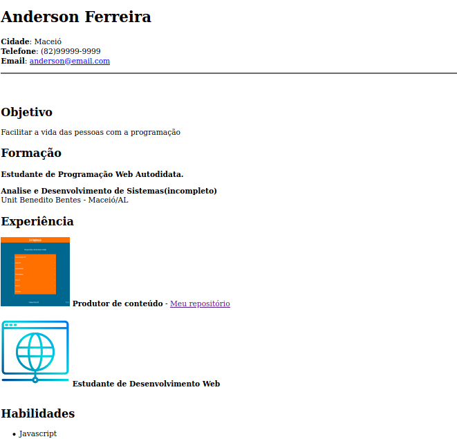

# Curriculum-vitae-html

Pequeno projeto para treinar os conceitos básicos do HTML.

## Conceitos aprendidos com o projeto
- [h1] - Para títulos de maior importância.
- [p] - Para parágrafos.
- [br] - Para quebra de linha (atualmente não é muito utilizado).
- [h2] - Usado para subtítulos.
- [strong] - Para deixar a palavra ou texto em negrito.
- [div] - Caixas vazias para colocar qualquer elemento. 
- [img] - Para inserir imagens.
- [ul] - Para criar listas.
- [li] - Para inserir os elementos dentro da lista.
 
